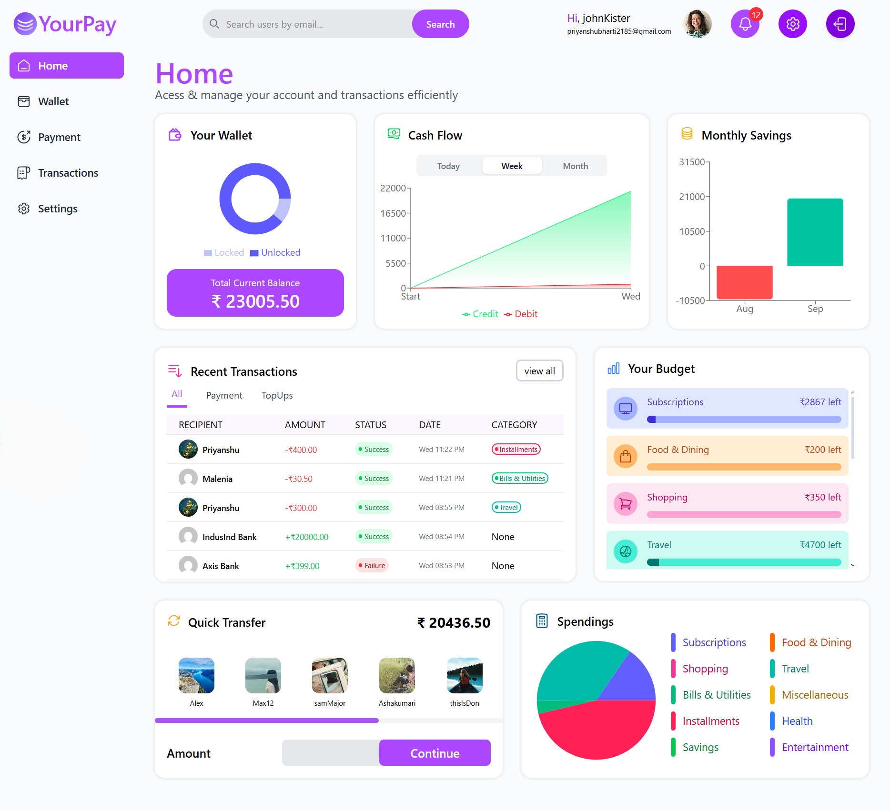
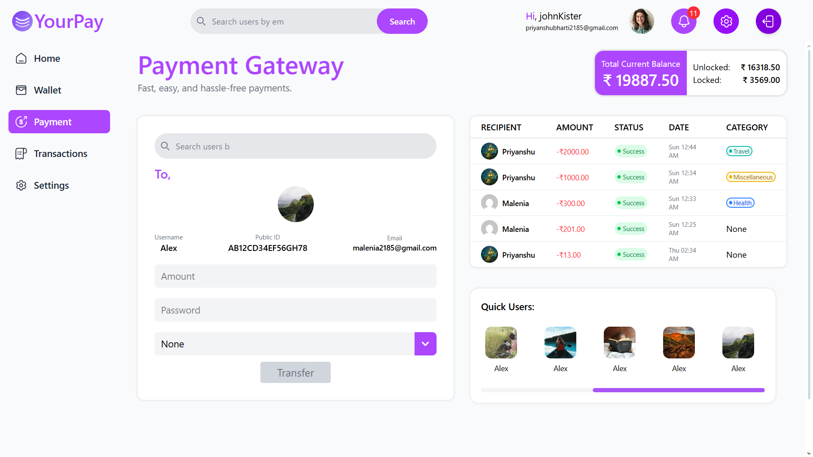
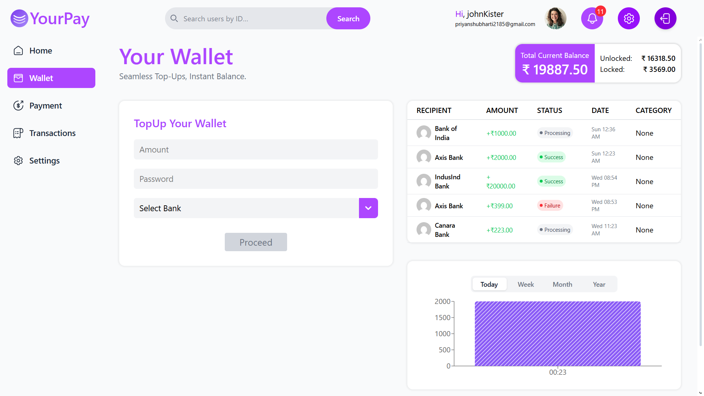
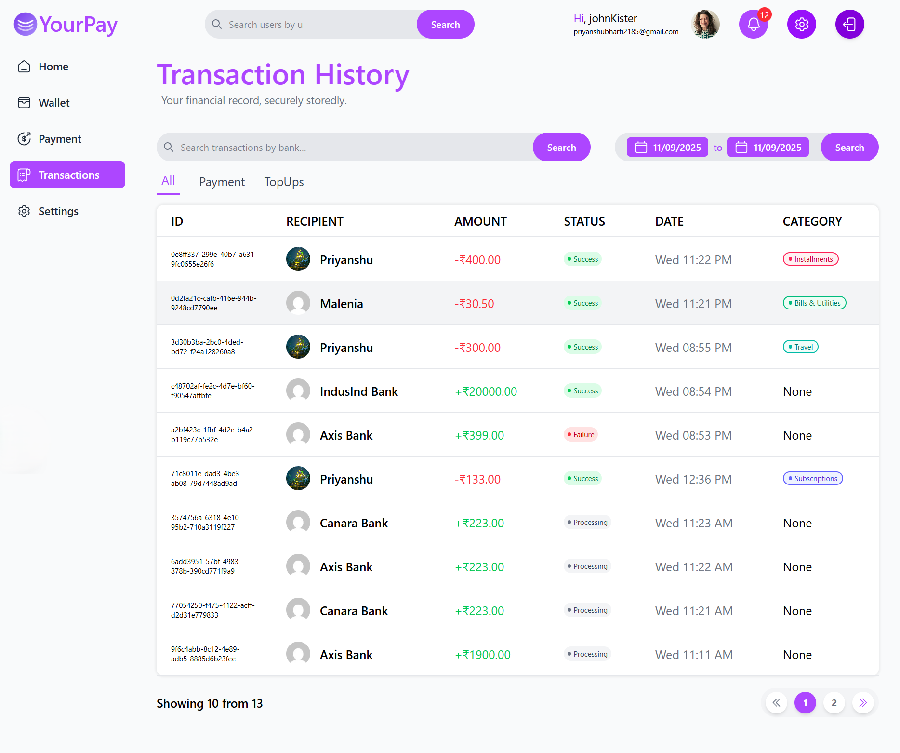
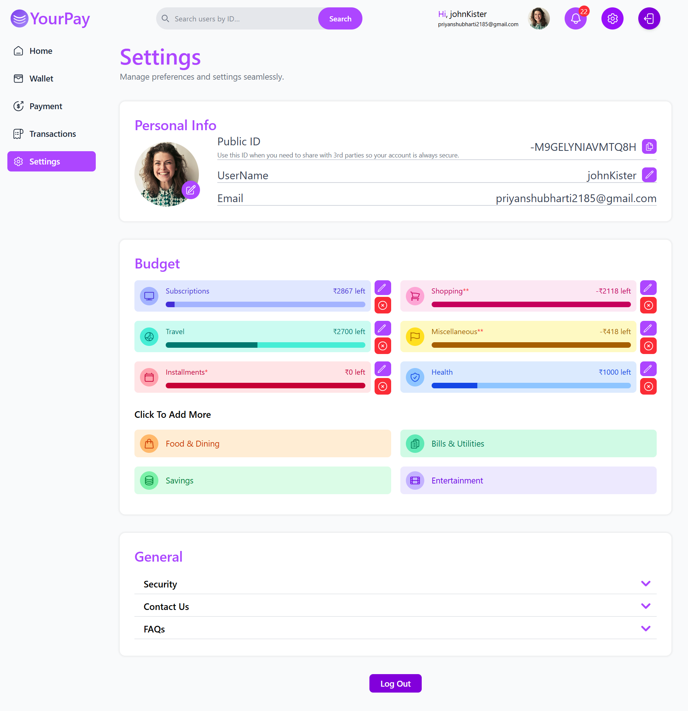
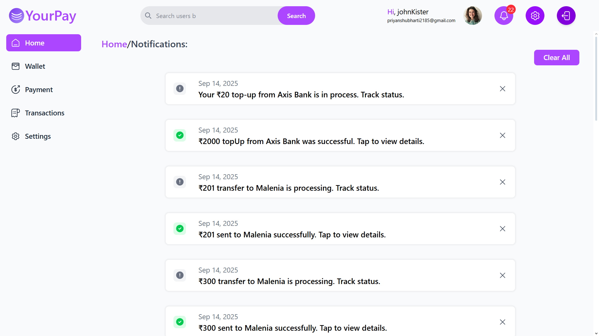

# YourPay

YourPay is a modern, secure, and intuitive **payment platform** designed to simplify financial transactions. Track your payments, visualize your spending, and manage your account seamlessly.

---

## 🚀 Features

- **User Authentication:** Secure signup and login system with JWT-based sessions.
- **Send & Receive Payments:** Instantly transfer money to other users.
- **Transaction History:** Detailed logs of all your past payments.
- **Analytics & Charts:**
  - Visualize spending and transactions using interactive charts.
  - Recharts-powered graphs for transaction trends, income vs expenses, and more.
- **Real-time Notifications:** Get notified instantly for incoming and outgoing payments.
- **Webhooks:** Event-driven notifications powered by Hono backend.
- **User Profiles:** Manage account information, settings, and preferences easily.

---

## 🛠 Tech Stack

- **Frontend:**
  - Next.js (React-based, server-side rendering)
  - Tailwind CSS
  - Recharts (interactive charts for analytics)

- **Backend:**
  - Next.js API routes
  - Hono (for webhooks and event-driven backend endpoints)
  - Prisma ORM
  - PostgreSQL

- **Authentication:**
  - JWT-based authentication

- **Deployment:**
  - Vercel (frontend & API routes)
  - Hono endpoints can run on Cloudflare Workers

- **Other Tools:**
  - Axios (API requests)
  - Zod (schema validation)
  - TurboRepo

---

## Screenshots

### Home

### Payment

### Wallet

### Transactions

### Settings

### Notifications

---
